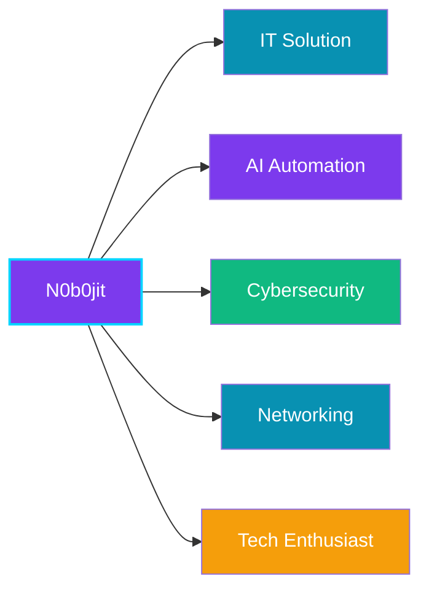

<!-- ╔════════════════════════════════════════════════════════════════╗ -->
<!-- ║                    NOBOJIT MAJUMDER - README                     ║ -->
<!-- ╚════════════════════════════════════════════════════════════════╝ -->

<div align="center">



<br/><br/>


<br/><br/>


<br/><br/>

<!-- ═══════════════════════════ SOCIAL ═══════════════════════════ -->
<table align="center" cellpadding="8" cellspacing="0">
  <tr>
    <td align="center">
      <a href="https://linkedin.com/in/mr-nobojit" target="_blank">
        
      </a>
    </td>
    <td align="center">
      <a href="https://instagram.com/mr_nobojit.m" target="_blank">
        
      </a>
    </td>
    <td align="center">
      <a href="https://facebook.com/nobojit" target="_blank">
        
      </a>
    </td>
    <td align="center">
      <a href="mailto:nobojitmajumder2005@gmail.com">
        
      </a>
    </td>
    <td align="center">
      <a href="https://github.com/N0b0jit/P0rtf0li0.git" target="_blank">
        
      </a>
    </td>
  </tr>
</table>

<br/>


</div>

<br/>

<!-- ═══════════════════════════ STATS ═══════════════════════════ -->
<h2 align="center">📈 Stats</h2>

<div align="center">
  
</div>

<div align="center">
  
  
</div>

<br/>

<!-- ═══════════════════════════ ABOUT ═══════════════════════════ -->
<h2 align="center">👨‍💻 About Me</h2>

<div align="center">

```
╔══════════════════════════════════════════════════════════════╗
║                                                              ║
║   > whoami                                                    ║
║   Nobojit Majumder                                           ║
║                                                              ║
║   > location                                                 ║
║   Khulna, Bangladesh 🇧🇩                                      ║
║                                                              ║
║   > education                                                ║
║   Computer Science & Technology                              ║
║                                                              ║
║   > status                                                   ║
║   Building + Learning + Solving + Innovate                   ║
║                                                              ║
║   > focus                                                    ║
║   IT Solution · AI Automation · Cybersecurity · Networking   ║
║                                                              ║
╚══════════════════════════════════════════════════════════════╝
```

</div>

<br/>

<!-- ═══════════════════════════ TECH STACK ═══════════════════════════ -->
<h2 align="center">⚡ Tech Stack</h2>

<div align="center">
  <table width="100%" cellpadding="8">
    <tr>
      <td align="center" width="20%" style="background: rgba(124,58,237,0.1); border-radius: 8px; padding: 10px;">
        <div style="color: #a78bfa; font-weight: bold; margin-bottom: 6px;">🖥️ OS</div>
        <div style="color: #c4b5fd; font-size: 12px;">Linux · Windows · Arch</div>
      </td>
      <td width="2%"></td>
      <td align="center" width="20%" style="background: rgba(8,145,178,0.1); border-radius: 8px; padding: 10px;">
        <div style="color: #22d3ee; font-weight: bold; margin-bottom: 6px;">💻 Languages</div>
        <div style="color: #a5f3fc; font-size: 12px;">Python · Bash</div>
      </td>
      <td width="2%"></td>
      <td align="center" width="20%" style="background: rgba(16,185,129,0.1); border-radius: 8px; padding: 10px;">
        <div style="color: #10b981; font-weight: bold; margin-bottom: 6px;">🌐 Frontend</div>
        <div style="color: #d1fae5; font-size: 12px;">HTML · CSS · JS</div>
      </td>
      <td width="2%"></td>
      <td align="center" width="20%" style="background: rgba(245,158,11,0.1); border-radius: 8px; padding: 10px;">
        <div style="color: #fbbf24; font-weight: bold; margin-bottom: 6px;">⚙️ Backend</div>
        <div style="color: #fef3c7; font-size: 12px;">Python</div>
      </td>
      <td width="2%"></td>
      <td align="center" width="20%" style="background: rgba(220,38,38,0.1); border-radius: 8px; padding: 10px;">
        <div style="color: #f87171; font-weight: bold; margin-bottom: 6px;">🗄️ Database</div>
        <div style="color: #fecaca; font-size: 12px;">SQL</div>
      </td>
    </tr>
  </table>
</div>

<div align="center" style="margin-top: 15px;">
  
  
  
  
  
</div>

<br/>

<!-- ═══════════════════════════ ROLES ═══════════════════════════ -->
<h2 align="center">🎯 Roles</h2>

<div align="center">
  <table width="95%" cellpadding="12">
    <tr>
      <td align="center" width="33%" style="background: linear-gradient(135deg, rgba(124,58,237,0.15), rgba(13,17,23,0.9)); border-left: 3px solid #7c3aed; border-radius: 0 12px 12px 0; padding: 18px;">
        <div style="color: #a78bfa; font-size: 18px; font-weight: bold; margin-bottom: 6px;">🖥️ IT Solution</div>
        <div style="color: #94a3b8; font-size: 12px;">Infrastructure · Deployment · Troubleshooting</div>
      </td>
      <td width="2%"></td>
      <td align="center" width="33%" style="background: linear-gradient(135deg, rgba(8,145,178,0.15), rgba(13,17,23,0.9)); border-left: 3px solid #0891b2; border-radius: 0 12px 12px 0; padding: 18px;">
        <div style="color: #22d3ee; font-size: 18px; font-weight: bold; margin-bottom: 6px;">🤖 AI Automation</div>
        <div style="color: #94a3b8; font-size: 12px;">N8N · Python · API · Workflows · Agents</div>
      </td>
      <td width="2%"></td>
      <td align="center" width="33%" style="background: linear-gradient(135deg, rgba(16,185,129,0.15), rgba(13,17,23,0.9)); border-left: 3px solid #10b981; border-radius: 0 12px 12px 0; padding: 18px;">
        <div style="color: #10b981; font-size: 18px; font-weight: bold; margin-bottom: 6px;">🛡️ Cybersecurity</div>
        <div style="color: #94a3b8; font-size: 12px;">Linux · Bash · Nmap · Burp · Networking</div>
      </td>
    </tr>
    <tr>
      <td height="12px"></td>
    </tr>
    <tr>
      <td align="center" width="33%" style="background: linear-gradient(135deg, rgba(220,38,38,0.15), rgba(13,17,23,0.9)); border-left: 3px solid #dc2626; border-radius: 0 12px 12px 0; padding: 18px;">
        <div style="color: #f87171; font-size: 18px; font-weight: bold; margin-bottom: 6px;">🌐 Networking</div>
        <div style="color: #94a3b8; font-size: 12px;">Network Design · Security · Infrastructure</div>
      </td>
      <td width="2%"></td>
      <td align="center" width="33%" style="background: linear-gradient(135deg, rgba(245,158,11,0.15), rgba(13,17,23,0.9)); border-left: 3px solid #f59e0b; border-radius: 0 12px 12px 0; padding: 18px;">
        <div style="color: #fbbf24; font-size: 18px; font-weight: bold; margin-bottom: 6px;">💻 Tech Enthusiast</div>
        <div style="color: #94a3b8; font-size: 12px;">Python · HTML · CSS · JS · SQL · Git</div>
      </td>
      <td width="2%"></td>
      <td align="center" width="33%" style="background: linear-gradient(135deg, rgba(99,102,241,0.15), rgba(13,17,23,0.9)); border-left: 3px solid #6366f1; border-radius: 0 12px 12px 0; padding: 18px;">
        <div style="color: #818cf8; font-size: 18px; font-weight: bold; margin-bottom: 6px;">⚡ Learner</div>
        <div style="color: #94a3b8; font-size: 12px;">Exploring · Solving · Innovating</div>
      </td>
    </tr>
  </table>
</div>

<br/>

<!-- ═══════════════════════════ INTERESTS ═══════════════════════════ -->
<h2 align="center">🎯 Interests</h2>

<div align="center">
  
  
  
  
  
</div>

<br/>

<!-- ═══════════════════════════ LANGUAGES ═══════════════════════════ -->
<h2 align="center">🌐 Languages</h2>

<div align="center">
  
  
  
  
  
  
</div>

<br/>

<!-- ═══════════════════════════ SNAKE ═══════════════════════════ -->
<h2 align="center">🐍 Contributions</h2>

<div align="center">
  <picture>
    <source media="(prefers-color-scheme: dark)"
      srcset="https://raw.githubusercontent.com/N0b0jit/N0b0jit/output/github-snake-dark.svg" />
    <source media="(prefers-color-scheme: light)"
      srcset="https://raw.githubusercontent.com/N0b0jit/N0b0jit/output/github-snake.svg" />
    
  </picture>
</div>

<br/>

<!-- ═══════════════════════════ FOOTER ═══════════════════════════ -->
<div align="center">
  
</div>

<div align="center">
  <sub>Made with ❤️ by <a href="https://github.com/N0b0jit">Nobojit</a> · 🇧🇩 Khulna, Bangladesh</sub>
</div>
